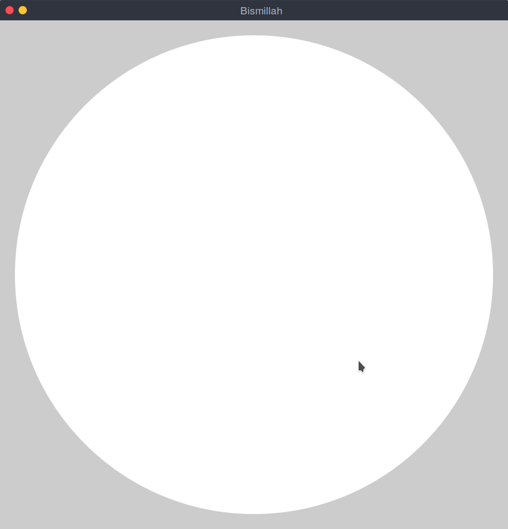
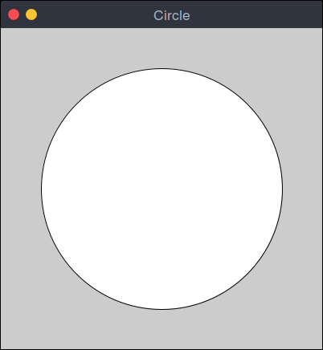
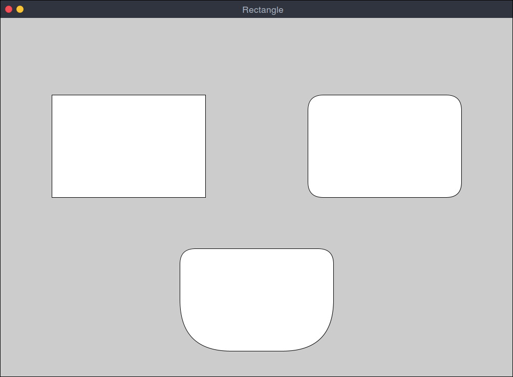
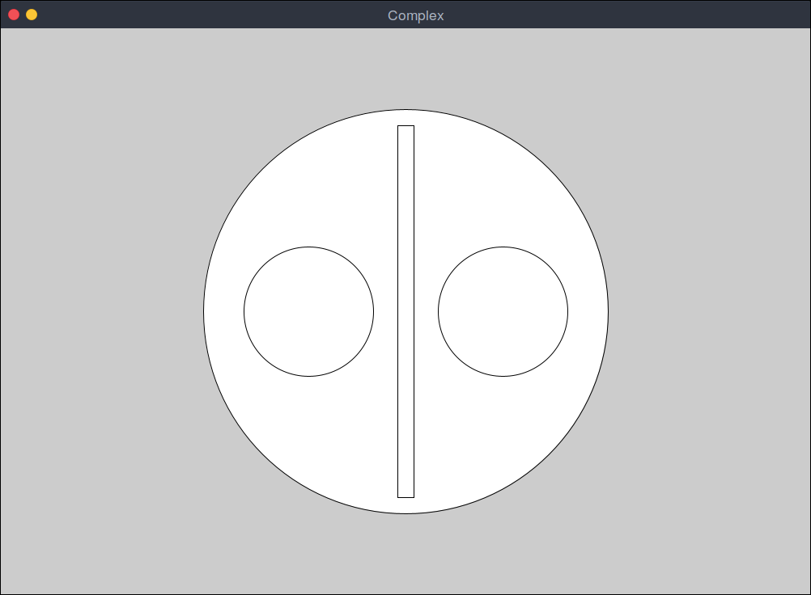
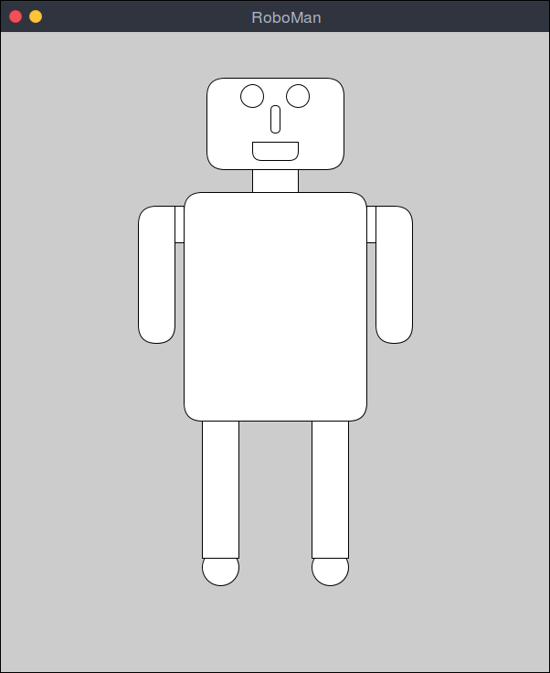
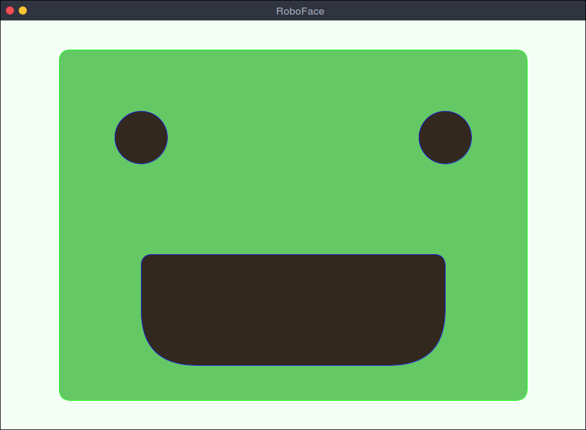
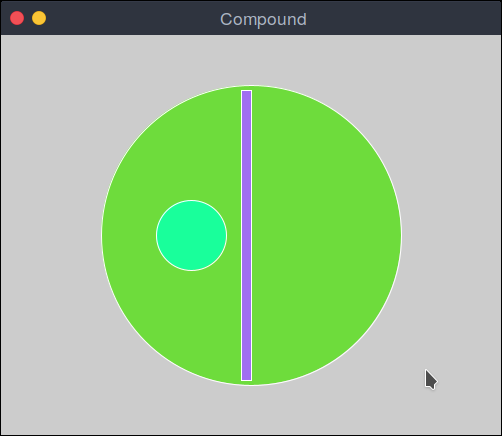
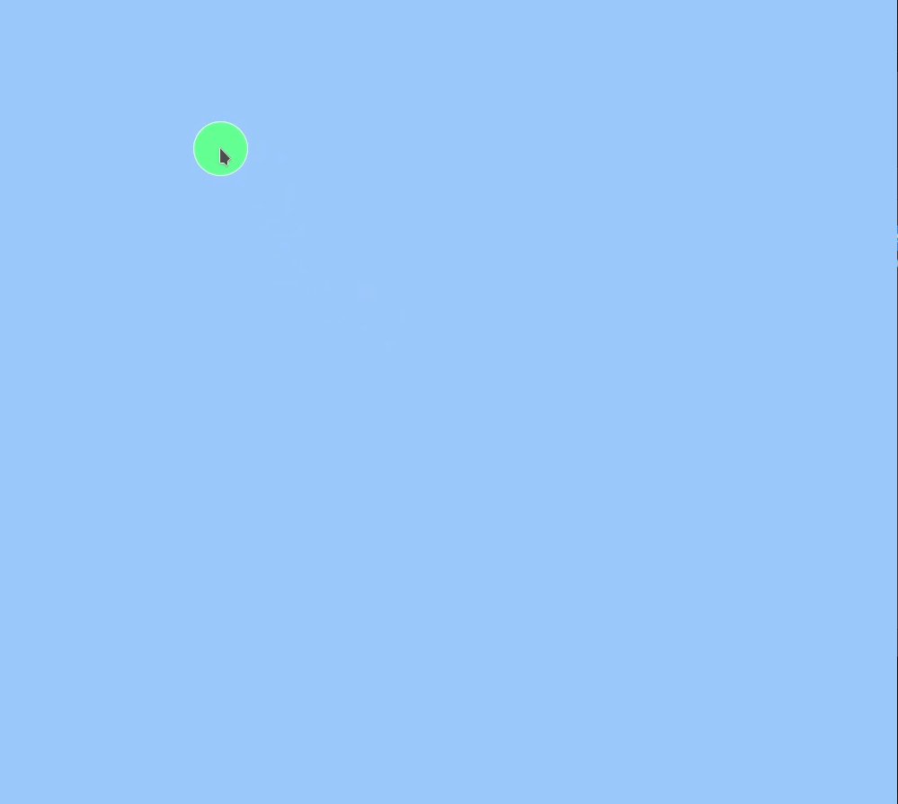
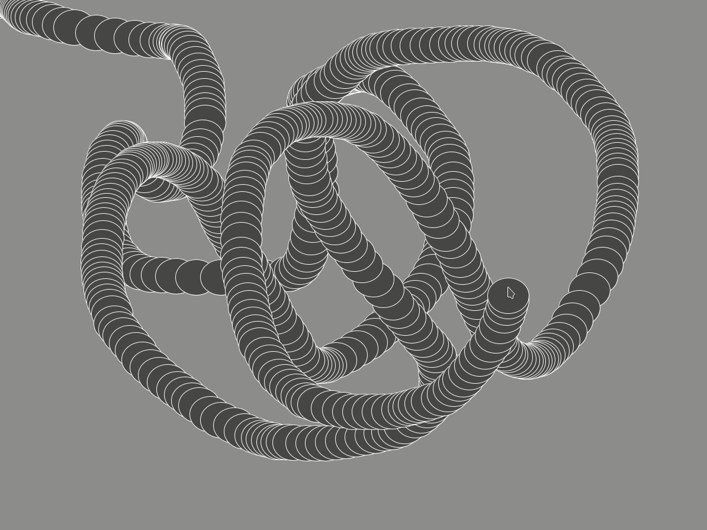

# Processing Arts and Programs 🎨🌟

Welcome to my **Processing Arts and Programs**, a collection of visually stunning artworks and interactive Java programs crafted by me with [Processing](https://processing.org/)!

---

## ✨ Table of Contents

1. [About the Project](#about-the-project)
2. [Features](#features)
3. [Gallery](#gallery)
   - [Images](#images)
   - [Videos](#videos)
4. [How to Run](#how-to-run)
5. [License](#license)

---

## 🚀 About the Project

This repository showcases a variety of creative arts and programs developed by me using **Processing**, an open-source graphical library and IDE built for visual design. Basically, I learn Java and have fun practicing it .

---

## ✨ Features

- **Creative Visuals**: A collection of beautiful static images and dynamic sketches.
- **Interactive Programs**: Engaging animations and interactive projects.
- **Easy-to-Run Files**: Open and play directly in the Processing IDE.

---

## 🖼️ Gallery

### 🎨 Images

Here are some static arts created in Processing:

1. **Bismillah**
   

2. **Circle**
   

3. **Rectangle**
   

4. **Complex**
   

5. **RoboMan**
   

6. **RoboFace**
   

7. **Compound**
   

---

### 🔄 Videos

Dynamic and interactive sketches in action:

- **MouseCursor**
  [](MouseCursor/MouseCursor.mkv)

- **MousePointer**
  [](MousePointer/MousePointer.mkv)

- **Painter**
  [](Painter/Painter.mkv)

- **ArtCanvas**
  [](ArtCanvas/ArtCanvas.mkv)  

---

## ⚙️ How to Run

Follow these steps to run the sketches on your machine:

1. **Install Processing**
   Download and install Processing from [here](https://processing.org/download).

2. **Clone the Repository**
   ```bash
   git clone https://github.com/IbnulMisbah/ProcessingArts.git
   ```

3. **Navigate to a Sketch Folder**
   Open any `.pde` file in the Processing IDE. Example:
   ```
   sketchbook/ArtCanvas/ArtCanvas.pde
   ```

4. **Run the Sketch**
   Click the play button in Processing to see the magic happen!

---


## 🔒 License

This project is licensed under the [MIT License](LICENSE). You are free to use, modify, and distribute it as long as you credit the original work.

---

## 🌟 Acknowledgements

- Special thanks to [Processing](https://processing.org/) for providing such an amazing platform for creative coding.

**Let’s create and inspire! 🚀**


